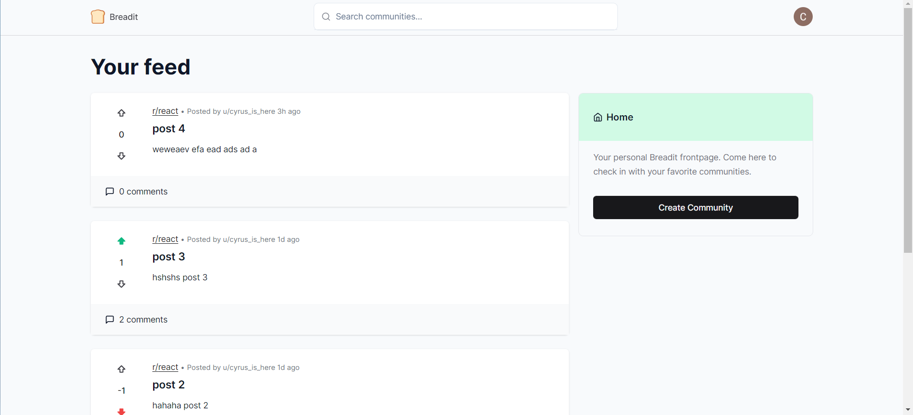
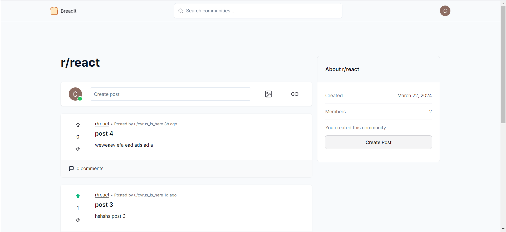
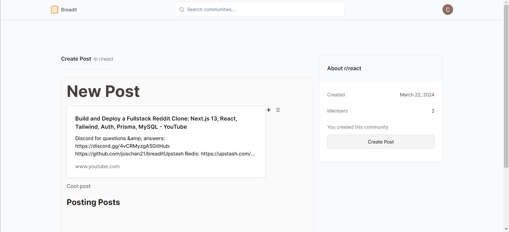

# Breadit App

  

This project is a fullstack application based on the following [tutorial](https://github.com/joschan21/breadit). It replicates core functionality of a popular website [reddit](https://www.reddit.com/).

In this branch you'll find:

- Typescript language.
- Infinite page scrolling.
- MySql for keeping general data and Redis for caching implementation.
- App Router navigation.
- Server- and clientside rendering.

## Changes

- Application relies on the services deployed locally.
- File `.env.example` contains most of the variables.

## Screenshots

  

  

  

  

